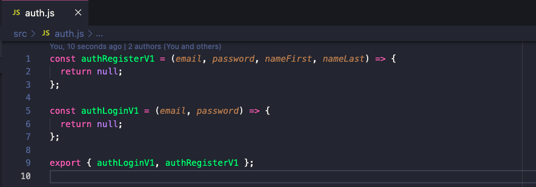
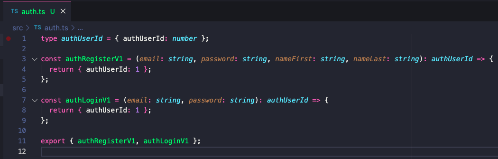

# COMP1531 Major Project

**✨ 🥜  UNSW Beans 🥜 ✨**

## Contents

[[_TOC_]]

## 0. Aims:

1. Demonstrate effective use of software development tools to build full-stack end-user applications.
2. Demonstrate effective use of static testing, dynamic testing, and user testing to validate and verify software systems.
3. Understand key characteristics of a functioning team in terms of understanding professional expectations, maintaining healthy relationships, and managing conflict.
4. Demonstrate an ability to analyse complex software systems in terms of their data model, state model, and more.
5. Understand the software engineering life cycle in the context of modern and iterative software development practices in order to elicit requirements, design systems thoughtfully, and implement software correctly.
6. Demonstrate an understanding of how to use version control, continuous integration, and deployment tooling to sustainably integrate code from multiple parties.

## 1. Overview

UNSW's revenue has been going down, despite the absolutely perfect MyExperience feedback.

Realising the bright potential of its students to recreate existing products they pay for, UNSW has tasked me (Hayden), and my army of COMP1531 students with recreating **<a href="https://www.microsoft.com/en-au/microsoft-teams/group-chat-software">Microsoft Teams</a>**.

The 22T3 cohort of COMP1531 students will build the **backend Javascript server** for a new communication platform, **UNSW Beans** (or just **Beans** for short). We plan to task future COMP6080 students to build the frontend for Beans, something you won't have to worry about.

**UNSW Beans** is the questionably-named communication tool that allows you to share, communicate, and collaborate virtually on a bean-like budget.

We have already specified a **common interface** for the frontend and backend to operate on. This allows both courses to go off and do their own development and testing under the assumption that both parties will comply with the common interface. This is the interface **you are required to use**.

The specific capabilities that need to be built for this project are described in the interface at the bottom. This is clearly a lot of features, but not all of them are to be implemented at once.

UNSW thanks you for doing your part in saving them approximately $100 per student, per year, despite making you pay for this course. 😊

(For legal reasons, this is a joke).

## 2. Iteration 0: Getting Started
Now complete!
## 3. Iteration 1: Basic Functionality and Tests

Now complete!

## 4. Iteration 2: Building a Web Server
### 4.1. Task

In this iteration, more features were added to the specification, and the focus has been changed to HTTP endpoints. Most of the theory surrounding iteration 2 is covered in week 4-5 lectures. Note that there will still be some features of the frontend that will not work because the routes will not appear until iteration 3. There is no introductory video for iteration 2.

In this iteration, you are expected to:

1. Make adjustments to your existing code as per any feedback given by your tutor for iteration 1.
2. Migrate to Typescript

    * Change `.js` file extension to `.ts`.

    * Run `npm run tsc` and incrementally fix all type errors.
    
    * Either choose to change one file at a time, or change all file extensions and use `// @ts-nocheck` at the beginning of select files to disable checking on that specific file, omitting errors.

    Below shows a sample conversion of auth.js => auth.ts
    
    

3. Implement and test the HTTP Express server according to the entire interface provided in the specification.

    * Part of this section may be automarked.

    * Your implementation should build upon your work in iteration 1, and ideally your HTTP layer is just a wrapper for underlying functions you've written that handle the logic, see week 4 content.

    * Your implementation will need to include persistence of data (see section 4.7).

    * Introduce tokens for session management (see 5.7).

    * You can structure your tests inside a `/tests` folder (or however you choose), as long as they are appended with `.test.js`. For this iteration and iteration 3 we will only be testing your HTTP layer of tests. You may still wish to use your iteration 1 tests and simply wrap up them - that is a design choice up to you. An example of an HTTP test can be found in section 4.4.

    * You do not have to rewrite all of your iteration 1 tests as HTTP tests - the latter can test the system at a higher level. For example, to test a success case for `message/send` via HTTP routes you will need to call `auth/register` and `channels/create`; this means you do not need the success case for those two functions seperately. Your HTTP tests will need to cover all success/error conditions for each endpoint, however.

4. Ensure your code is linted to the provided style guide

    * `eslint` should be added to your repo via `npm` and then added to your `package.json` file to run when the command `npm run lint` is run. The provided `.eslintrc.json` file is *very* lenient, so there is no reason you should have to disable any additional checks. See section 4.5 below for instructions on adding linting to your pipeline.

    * You are required to edit the `gitlab-ci.yml` file, as per section 4.5 to add linting to the code on `master`. **You must do this BEFORE merging anything from iteration 2 into `master`**, so that you ensure `master` is always stable.

5. Continue demonstrating effective project management and effective git usage

    * You will be heavily marked for your use of thoughtful project management and use of git effectively. The degree to which your team works effectively will also be assessed.

    * As for iteration 1, all task tracking and management will need to be done via the GitLab Issue Board or another tracking application approved by your tutor.

    * As for iteration 1, regular group meetings must be documented with meeting minutes which should be stored at a timestamped location in your repo (e.g. uploading a word doc/pdf or writing in the GitLab repo wiki after each meeting).

    * As for iteration 1, you must be able to demonstrate evidence of regular standups.

    * You are required to regularly and thoughtfully make merge requests for the smallest reasonable units, and merge them into `master`.

A frontend has been built that you can use in this iteration, and use your backend to power it (note: an incomplete backend will mean the frontend cannot work). You can, if you wish, make changes to the frontend code, but it is not required. The source code for the frontend is only provided for your own fun or curiosity.

**As part of this iteration it is required that your backend code can correctly power the frontend**. You should conduct acceptance tests (run your backend, run the frontend and check that it works) prior to submission.

In this iteration we also expect for you to improve on any feedback left by tutors in iteration 1.

### 4.2. Running the server

To run the server you can the following command from the root directory of your project:

```bash
npm start
```

This will start the server on the port in the src/server.ts file, using `ts-node`.

If you get an error stating that the address is already in use, you can change the port number in `config.json` to any number from `1024` to `49151`. Is it likely that another student may be using your original port number.

### 4.3. Implementing and testing features

You should first approach this project by considering its distinct "features". Each feature should add some meaningful functionality to the project, but still be as small as possible. You should aim to size features as the smallest amount of functionality that adds value without making the project more unstable. For each feature you should:

1. Create a new branch.
2. Write tests for that feature and commit them to the branch. These will fail as you have not yet implemented the feature.
3. Implement that feature.
4. Make any changes to the tests such that they pass with the given implementation. You should not have to do a lot here. If you find that you are, you're not spending enough time on your tests.
5. Create a merge request for the branch.
6. Get someone in your team who **did not** work on the feature to review the merge request. When reviewing, **not only should you ensure the new feature has tests that pass.**
7. Fix any issues identified in the review.
8. Merge the merge request into master.

For this project, a feature is typically sized somewhere between a single function, and a whole file of functions (e.g. `auth.ts`). It is up to you and your team to decide what each feature is.

There is no requirement that each feature be implemented by only one person. In fact, we encourage you to work together closely on features, especially to help those who may still be coming to grips with Javascript.

Please pay careful attention to the following:

Your tests, keep in mind the following:
* We want to see **evidence that you wrote your tests before writing the implementation**. As noted above, the commits containing your initial tests should appear *before* your implementation for every feature branch. If we don't see this evidence, we will assume you did not write your tests first and your mark will be reduced.
* You should have black-box tests for all tests required (i.e. testing each function/endpoint). However, you are also welcome to write whitebox unit tests in this iteration if you see that as important.
* Merging in merge requests with failing pipelines is **very bad practice**. Not only does this interfere with your teams ability to work on different features at the same time, and thus slow down development, it is something you will be penalised for in marking.
* Similarly, merging in branches with untested features is also **very bad practice**. We will assume, and you should too, that any code without tests does not work.
* Pushing directly to `master` is not possible for this repo. The only way to get code into `master` is via a merge request. If you discover you have a bug in `master` that got through testing, create a bugfix branch and merge that in via a merge request.
* As is the case with any system or functionality, there will be some things that you can test extensively, some things that you can test sparsely/fleetingly, and some things that you can't meaningfully test at all. You should aim to test as extensively as you can, and make judgements as to what things fall into what categories.

### 4.4. Testing the interface

In this iteration, **the layer of abstraction has changed to the HTTP level**, meaning that you are only required to write integration tests that check the HTTP endpoints, rather than the style of tests you write in iteration 1 where the behaviour of the Javascript functions themselves was tested.

You will need to check as appropriate for each success/error condition:
* The return value of the endpoint;
* The behaviour (side effects) of the endpoint; and
* The status code of the response.

An example of how you would now test the echo interface is:

```javascript
const { echo } = require('./echo');
const request = require('sync-request');

const OK = 200;

describe('HTTP tests using Jest', () => {
  test('Test successful echo', () => {
    const res = request(
      'GET',
            `${url}:${port}/echo`,
            {
              qs: {
                echo: 'Hello',
              }
            }
    );
    const bodyObj = JSON.parse(res.body as string);
    expect(res.statusCode).toBe(OK);
    expect(bodyObj).toEqual('Hello');
  });
  test('Test invalid echo', () => {
    const res = request(
      'GET',
            `${url}:${port}/echo`,
            {
              qs: {
                echo: 'echo',
              }
            }
    );
    const bodyObj = JSON.parse(res.body as string);
    expect(res.statusCode).toBe(OK);
    expect(bodyObj).toStrictEqual({ error: 'error' });
  });
});
```

### 4.5. Continuous Integration

With the introduction of linting to the project with `ESlint`, you will need to manually edit the `gitlab-ci.yml` file to lint code within the pipeline. This will require the following:
* Addition of `npm run lint` as a script under a custom `linting` variable, apart of `stage: checks`.
Refer to the lecture slides on continuous integration to find exactly how you should add these.

### 4.6. Recommended approach

Our recommendation with this iteration is that you start out trying to implement the new functions similarly to how you did in iteration 1.

1. Write HTTP unit tests. These will fail as you have not yet implemented the feature.
    * Hint: It would be a good idea to consider good test design and the usage of helper functions for your HTTP tests. Is there a way so that you do not have to completely rewrite your tests from iteration 1?
2. Implement the feature and write the Express route/endpoint for that feature too.
  * HINT: make sure GET and DELETE requests utilise query parameters, whereas POST and PUT requests utilise JSONified bodies.
3. Run the tests and continue following 4.3. as necessary.

### 4.7. Storing data

You are required to store data persistently in this iteration.

Modify your backend such that it is able to persist and reload its data store if the process is stopped and started again. The persistence should happen at regular intervals so that in the event of unexpected program termination (e.g. sudden power outage) a minimal amount of data is lost. You may implement this using whatever method of serialisation you prefer (e.g. JSON).

### 4.8. Versioning

You might notice that some routes are suffixed with `v1` and `v2`, and that all the new routes are `v1` yet all the old routes are `v2`. Why is this? When you make changes to specifications, it's usually good practice to give the new function/capability/route a different unique name. This way, if people are using older versions of the specification they can't accidentally call the updated function/route with the wrong data input.

Hint: Yes, your `v2` routes can use the `functionNameV1` functions you had in iteration 1, regardless of whether you rename the functions or not. The layer of abstraction in iteration 2 has changed from the function interface to the HTTP interface, and therefore your 'functions' from iteration 1 are essentially now just implementation details, and therefore are completely modifiable by you.

### 4.9. Dryrun

We have provided a very simple dryrun for iteration 2 consisting of 4 tests, one each for your implementation of `clear/v1`, `auth/register/v2`, `channels/create/v2`, and `channels/list/v2`. These only check whether your server wrapper functions accept requests correctly, the format of your return types and simple expected behaviour, so do not rely on these as an indicator for the correctness of your implementation or tests.

To run the dryrun, you should be in the root directory of your project (e.g. `/project-backend`) and use the command:

```bash
1531 dryrun 2
```

### 4.10. Marking Criteria

<table>
  <tr>
    <th>Section</th>
    <th>Weighting</th>
    <th>Criteria</th>
  </tr>
  <tr>
    <td>Automarking (Testing & Implementation)</td>
    <td>50%</td>
    <td><ul>
      <li>Correct implementation of specified functions</li>
      <li>Correctly written tests based on the specification requirements</li>
      <li>Correctly linted code</li>
      <li>Correctly typechecked code</li>
    </ul></td>
  </tr>
  <tr>
    <td>Code Quality</td>
    <td>30%</td>
    <td><ul>
      <li>Demonstrated an understanding of good test <b>coverage</b></li>
      <li>Demonstrated an understanding of the importance of <b>clarity</b> on the communication test and code purposes</li>
      <li>Demonstrated an understanding of thoughtful test <b>design</b></li>
      <li>Appropriate use of Javascript data structures (arrays, objects, etc.)</li>
      <li>Appropriate style as described in section 7.4</li>
      <li>Appropriate application of good software design practices</li>
      <li>Implementation of persistent state</li>
      <li>Demonstrated successful connection of the supplied frontend to the backend code required for iteration 2</li>
    </ul></td>
  </tr>
  <tr>
    <td>Git & Project Management</td>
    <td>20%</td>
    <td><ul>
      <li>Correctly altered gitlab-ci.yml file, before new code has been merged to master</li>
      <li>Meaningful and informative git commit names being used</li>
      <li>At least 12 merge requests into master made</li>
      <li>A generally equal contribution between team members</li>
      <li>Clear evidence of reflection on group's performance and state of the team, with initiative to improve in future iterations</li>
      <li>Effective use of course-provided MS Teams for communicating, demonstrating an ability to communicate and manage effectivelly digitally</li>
      <li>Use of issue board on Gitlab to track and manage tasks</li>
      <li>Effective use of agile methods such as standups</li>
      <li>Minutes/notes taken from group meetings (and stored in a logical place in the repo)</li>
    </ul></td>
  </tr>
</table>

For this and for all future milestones, you should consider the other expectations as outlined in section 7 below.

The formula used for automarking in this iteration is:

`Automark = 90*(t * i) + 5*e + 5*f`
(Mark equals 95% of `t` multiplied by `i` plus 5% of `e` plus 5% of `f`). This formula produces a value between 0 and 1.

Where:
 * `t` is the mark between 0-1 you receive for your tests running against your code (100% = your implementation passes all of your tests)
 * `i` is the mark between 0-1 you receive for our course tests (hidden) running against your code (100% = your implementation passes all of our tests)
 * `e` is the score between 0-1 achieved by running eslint against your code with the provided configuration
 * `f` is the score between 0-1 achieved by running typechecking against your code with the provided configuration

### 4.11. Submission

This iteration due date and demonstration week is described in section 6. You will demonstrate this submission in line with the information provided in section 7.

### 4.12. Peer Assessment

Reference 7.5.
## 5. Interface specifications

These interface specifications come from Hayden & COMP6080, who are building the frontend to the requirements set out below.

### 5.1. Input/Output types

#### 5.1.1. Iteration 0+ Input/Output Types
<table>
  <tr>
    <th>Variable name</th>
    <th>Type</th>
  </tr>
  <tr>
    <td>named exactly <b>email</b></td>
    <td>string</td>
  </tr>
  <tr>
    <td>has suffix <b>id</b></td>
    <td>integer</td>
  </tr>
  <tr>
    <td>contains substring <b>password</b></td>
    <td>string</td>
  </tr>
  <tr>
    <td>named exactly <b>message</b></td>
    <td>string</td>
  </tr>
  <tr>
    <td>named exactly <b>start</b></td>
    <td>integer</td>
  </tr>
  <tr>
    <td>contains substring <b>name</b></td>
    <td>string</td>
  </tr>
  <tr>
    <td>has prefix <b>is</b></td>
    <td>boolean</td>
  </tr>
</table>

#### 5.1.2. Iteration 1+ Input/Output Types

<table>
  <tr>
    <th>Variable name</th>
    <th>Type</th>
  </tr>
  <tr>
    <td>named exactly <b>email</b></td>
    <td>string</td>
  </tr>
  <tr>
    <td>has suffix <b>id</b></td>
    <td>integer</td>
  </tr>
  <tr>
    <td>named exactly <b>length</b></td>
    <td>integer</td>
  </tr>
  <tr>
    <td>named exactly <b>start</b></td>
    <td>integer</td>
  </tr>
  <tr>
    <td>contains substring <b>password</b></td>
    <td>string</td>
  </tr>
  <tr>
    <td>named exactly <b>message</b></td>
    <td>string</td>
  </tr>
  <tr>
    <td>contains substring <b>name</b></td>
    <td>string</td>
  </tr>
  <tr>
    <td>has prefix <b>is</b></td>
    <td>boolean</td>
  </tr>
  <tr>
    <td>has prefix <b>time</b></td>
    <td>integer (unix timestamp in seconds), <a href="https://stackoverflow.com/questions/9756120/how-do-i-get-a-utc-timestamp-in-javascript">[check this out]</a></td>
  </tr>
  <tr>
    <td>(outputs only) named exactly <b>messages</b></td>
    <td>Array of objects, where each object contains types { messageId, uId, message, timeSent }</td>
  </tr>
  <tr>
    <td>(outputs only) named exactly <b>channels</b></td>
    <td>Array of objects, where each object contains types { channelId, name }</td>
  </tr>
  <tr>
    <td>has suffix <b>Str</b></td>
    <td>string</td>
  </tr>
  <tr>
    <td>(outputs only) named exactly <b>user</b></td>
    <td>Object containing uId, email, nameFirst, nameLast, handleStr</td>
  </tr>
  <tr>
    <td>(outputs only) name ends in <b>members</b></td>
    <td>Array of objects, where each object contains types of <b>user</b></td>
  </tr>
  <tr>
    <td>(outputs only) named exactly <b>users</b></td>
    <td>Array of objects, where each object contains types of <b>user</b></td>
  </tr>
</table>

#### 5.1.3. Iteration 2+ Input/Output

<table>
  <tr>
    <th>Variable name</th>
    <th>Type</th>
  </tr>
  <tr>
    <td>named exactly <b>token</b></td>
    <td>string</td>
  </tr>
  <tr>
    <td>(outputs only) named exactly <b>dms</b></td>
    <td>Array of objects, where each object contains types { dmId, name }</td>
  </tr>
  <tr>
    <td>named exactly <b>uIds</b></td>
    <td>Array of user ids</td>
  </tr>
</table>

### 5.2. Interface

### 5.2.3. Iteration 2 Interface

All error cases should return <code>{error: 'error'}</code>, where the error message in quotations can be anything you like (this will not be marked).

<table>
  <tr>
    <th>Name & Description</th>
    <th>HTTP Method</th>
    <th style="width:18%">Data Types</th>
    <th style="width:32%">Error returns</th>
  </tr>
  <tr>
    <td><code>auth/login/v2</code><br /><br />Given a registered user's email and password, returns their <code>authUserId</code> value.</td>
    <td style="font-weight: bold; color: blue;">POST</td>
    <td><b>Body Parameters:</b><br /><code>( email, password )</code><br /><br /><b>Return type if no error:</b><br /><code>{ token, authUserId }</code></td>
    <td>
      <b>Return object <code>{error: 'error'}</code></b> when any of:
      <ul>
        <li>email entered does not belong to a user</li>
        <li>password is not correct</li>
      </ul>
    </td>
  </tr>
  <tr>
    <td><code>auth/register/v2</code><br /><br />Given a user's first and last name, email address, and password, creates a new account for them and returns a new <code>authUserId</code>.<br /><br />A unique handle will be generated for each registered user. The user handle is created as follows:
      <ul>
        <li>First, generate a concatenation of their casted-to-lowercase alphanumeric (a-z0-9) first name and last name (i.e. make lowercase then remove non-alphanumeric characters).</li>
        <li>If the concatenation is longer than 20 characters, it is cut off at 20 characters.</li>
        <li>If this handle is already taken by another user, append the concatenated names with the smallest number (starting from 0) that forms a new handle that isn't already taken.</li>
        <li>The addition of this final number may result in the handle exceeding the 20 character limit (the handle 'abcdefghijklmnopqrst0' is allowed if the handle 'abcdefghijklmnopqrst' is already taken).</li>
      </ul>
    </td>
    <td style="font-weight: bold; color: blue;">POST</td>
    <td><b>Body Parameters:</b><br /><code>( email, password, nameFirst, nameLast )</code><br /><br /><b>Return type if no error:</b><br /><code>{ token, authUserId }</code></td>
    <td>
      <b>Return object <code>{error: 'error'}</code></b> when any of:
      <ul>
        <li>email entered is not a valid email (more in section 5.3)</li>
        <li>email address is already being used by another user</li>
        <li>length of password is less than 6 characters</li>
        <li>length of nameFirst is not between 1 and 50 characters inclusive</li>
        <li>length of nameLast is not between 1 and 50 characters inclusive</li>
      </ul>
    </td>
  </tr>
  <tr>
    <td><code>channels/create/v2</code><br /><br />Creates a new channel with the given name that is either a public or private channel. The user who created it automatically joins the channel and is the owner.</td>
    <td style="font-weight: bold; color: blue;">POST</td>
    <td><b>Body Parameters:</b><br /><code>( token, name, isPublic )</code><br /><br /><b>Return type if no error:</b><br /><code>{ channelId }</code></td>
    <td>
      <b>Return object <code>{error: 'error'}</code></b> when any of:
      <ul>
        <li>length of name is less than 1 or more than 20 characters</li>
        <li><code>token</code> is invalid</li>
      </ul>
    </td>
  </tr>
  <tr>
    <td><code>channels/list/v2</code><br /><br />Provide a list of all channels (and their associated details) that the authorised user is part of.</td>
    <td style="font-weight: bold; color: green;">GET</td>
    <td><b>Query Parameters:</b><br /><code>( token )</code><br /><br /><b>Return type if no error:</b><br /><code>{ channels }</code></td>
    <td>
      <b>Return object <code>{error: 'error'}</code></b> when any of:
      <ul>
        <li><code>token</code> is invalid</li>
      </ul>
    </td>
  </tr>
  <tr>
    <td><code>channels/listAll/v2</code><br /><br />Provide a list of all channels, including private channels, (and their associated details)</td>
    <td style="font-weight: bold; color: green;">GET</td>
    <td><b>Query Parameters:</b><br /><code>( token )</code><br /><br /><b>Return type if no error:</b><br /><code>{ channels }</code></td>
    <td>
      <b>Return object <code>{error: 'error'}</code></b> when any of:
      <ul>
        <li><code>token</code> is invalid</li>
      </ul>
    </td>
  </tr>
  <tr>
    <td><code>channel/details/v2</code><br /><br />Given a channel with ID <code>channelId</code> that the authorised user is a member of, provide basic details about the channel.</td>
    <td style="font-weight: bold; color: green;">GET</td>
    <td><b>Query Parameters:</b><br /><code>( token, channelId )</code><br /><br /><b>Return type if no error:</b><br /><code>{ name, isPublic, ownerMembers, allMembers }</code></td>
    <td>
      <b>Return object <code>{error: 'error'}</code></b> when any of:
      <ul>
        <li>channelId does not refer to a valid channel</li>
        <li>channelId is valid and the authorised user is not a member of the channel</li>
        <li><code>token</code> is invalid</li>
      </ul>
    </td>
  </tr>
  <tr>
    <td><code>channel/join/v2</code><br /><br />Given a <code>channelId</code> of a channel that the authorised user can join, adds them to that channel.</td>
    <td style="font-weight: bold; color: blue;">POST</td>
    <td><b>Body Parameters:</b><br /><code>( token, channelId )</code><br /><br /><b>Return type if no error:</b><br /><code>{}</code></td>
    <td>
      <b>Return object <code>{error: 'error'}</code></b> when any of:
      <ul>
        <li>channelId does not refer to a valid channel</li>
        <li>the authorised user is already a member of the channel</li>
        <li>channelId refers to a channel that is private and the authorised user is not already a channel member and is not a global owner</li>
        <li><code>token</code> is invalid</li>
      </ul>
    </td>
  </tr>
  <tr>
    <td><code>channel/invite/v2</code><br /><br />Invites a user with ID <code>uId</code> to join a channel with ID channelId. Once invited, the user is added to the channel immediately. In both public and private channels, all members are able to invite users.</td>
    <td style="font-weight: bold; color: blue;">POST</td>
    <td><b>Body Parameters:</b><br /><code>( token, channelId, uId )</code><br /><br /><b>Return type if no error:</b><br /><code>{}</code></td>
    <td>
      <b>Return object <code>{error: 'error'}</code></b> when any of:
      <ul>
        <li>channelId does not refer to a valid channel</li>
        <li>uId does not refer to a valid user</li>
        <li>uId refers to a user who is already a member of the channel</li>
        <li>channelId is valid and the authorised user is not a member of the channel</li>
        <li><code>token</code> is invalid</li>
      </ul>
    </td>
  </tr>
  <tr>
    <td><code>channel/messages/v2</code><br /><br />Given a channel with ID <code>channelId</code> that the authorised user is a member of, return up to 50 messages between index "start" and "start + 50". Message with index 0 is the most recent message in the channel. This function returns a new index "end" which is the value of "start + 50", or, if this function has returned the least recent messages in the channel, returns -1 in "end" to indicate there are no more messages to load after this return.</td>
    <td style="font-weight: bold; color: green;">GET</td>
    <td><b>Query Parameters:</b><br /><code>( token, channelId, start )</code><br /><br /><b>Return type if no error:</b><br /><code>{ messages, start, end }</code></td>
    <td>
      <b>Return object <code>{error: 'error'}</code></b> when any of:
      <ul>
        <li>channelId does not refer to a valid channel</li>
        <li>start is greater than the total number of messages in the channel</li>
        <li>channelId is valid and the authorised user is not a member of the channel</li>
        <li><code>token</code> is invalid</li>
      </ul>
    </td>
  </tr>
  <tr>
    <td><code>user/profile/v2</code><br /><br />For a valid user, returns information about their userId, email, first name, last name, and handle
    </td>
    <td style="font-weight: bold; color: green;">GET</td>
    <td><b>Query Parameters:</b><br /><code>( token, uId )</code><br /><br /><b>Return type if no error:</b><br /><code>{ user }</code></td>
    <td>
      <b>Return object <code>{error: 'error'}</code></b> when any of:
      <ul>
        <li>uId does not refer to a valid user</li>
        <li><code>token</code> is invalid</li>
      </ul>
    </td>
  </tr>
  <tr>
    <td><code>clear/v1</code><br /><br />Resets the internal data of the application to its initial state</td>
    <td style="font-weight: bold; color: red;">DELETE</td>
    <td><b>Parameters:</b><br /><code>()</code><br /><br /><b>Return type if no error:</b><br /><code>{}</code></td>
    <td>N/A</td>
  </tr>
  <tr>
    <td><code>auth/logout/v1</code><br /><br />Given an active token, invalidates the token to log the user out.</td>
    <td style="font-weight: bold; color: blue;">POST</td>
    <td><b>Body Parameters:</b><br /><code>{ token }</code><br /><br /><b>Return type if no error:</b><br /><code>{}</code></td>
    <td>
      <b>Return object <code>{error: 'error'}</code></b> when any of:
      <ul>
        <li><code>token</code> is invalid</li>
      </ul>
    </td>
  </tr>
  <tr>
    <td><code>channel/leave/v1</code><br /><br />Given a channel with ID <code>channelId</code> that the authorised user is a member of, remove them as a member of the channel. Their messages should remain in the channel. If the only channel owner leaves, the channel will remain.</td>
    <td style="font-weight: bold; color: blue;">POST</td>
    <td><b>Body Parameters:</b><br /><code>{ token, channelId }</code><br /><br /><b>Return type if no error:</b><br /><code>{}</code></td>
    <td>
      <b>Return object <code>{error: 'error'}</code></b> when any of:
        <ul>
          <li>channelId does not refer to a valid channel</li>
          <li>channelId is valid and the authorised user is not a member of the channel</li>
          <li><code>token</code> is invalid</li>
        </ul>
    </td>
  </tr>
  <tr>
    <td><code>channel/addowner/v1</code><br /><br />Make user with user id <code>uId</code> an owner of the channel.</td>
    <td style="font-weight: bold; color: blue;">POST</td>
    <td><b>Body Parameters:</b><br /><code>{ token, channelId, uId }</code><br /><br /><b>Return type if no error:</b><br /><code>{}</code>
    </td>
    <td>
      <b>Return object <code>{error: 'error'}</code></b> when any of:
        <ul>
        <li>channelId does not refer to a valid channel</li>
        <li>uId does not refer to a valid user</li>
        <li>uId refers to a user who is not a member of the channel</li>
        <li>uId refers to a user who is already an owner of the channel</li>
        <li>channelId is valid and the authorised user does not have owner permissions in the channel</li>
        <li><code>token</code> is invalid</li>
        </ul>
    </td>
  </tr>
  <tr>
    <td><code>channel/removeowner/v1</code><br /><br />Remove user with user id uId as an owner of the channel.</td>
    <td style="font-weight: bold; color: blue;">POST</td>
    <td><b>Body Parameters:</b><br /><code>{ token, channelId, uId }</code><br /><br /><b>Return type if no error:</b><br /><code>{}</code></td>
    <td>
      <b>Return object <code>{error: 'error'}</code></b> when any of:
        <ul>
        <li>channelId does not refer to a valid channel</li>
        <li>uId does not refer to a valid user</li>
        <li>uId refers to a user who is not an owner of the channel</li>
        <li>uId refers to a user who is currently the only owner of the channel</li>
        <li>channelId is valid and the authorised user does not have owner permissions in the channel</li>
        <li><code>token</code> is invalid</li>
        </ul>
    </td>
  </tr>
  <tr>
    <td><code>message/send/v1</code><br /><br />Send a message from the authorised user to the channel specified by <code>channelId</code>. Note: Each message should have its own unique ID, i.e. no messages should share an ID with another message, even if that other message is in a different channel.</td>
    <td style="font-weight: bold; color: blue;">POST</td>
    <td><b>Body Parameters:</b><br /><code>{ token, channelId, message }</code><br /><br /><b>Return type if no error:</b><br /><code>{ messageId }</code></td>
    <td>
      <b>Return object <code>{error: 'error'}</code></b> when any of:
        <ul>
        <li>channelId does not refer to a valid channel</li>
        <li>length of message is less than 1 or over 1000 characters</li>
        <li>channelId is valid and the authorised user is not a member of the channel</li>
        <li><code>token</code> is invalid</li>
        </ul>
    </td>
  </tr>
  <tr>
    <td><code>message/edit/v1</code><br /><br />Given a message, update its text with new text. If the new message is an empty string, the message is deleted.</td>
    <td style="font-weight: bold; color: brown;">PUT</td>
    <td><b>Body Parameters:</b><br /><code>{ token, messageId, message }</code><br /><br /><b>Return type if no error:</b><br /><code>{}</code></td>
    <td>
      <b>Return object <code>{error: 'error'}</code></b> when any of:
        <ul>
        <li>length of message is over 1000 characters</li>
        <li>messageId does not refer to a valid message within a channel/DM that the authorised user has joined</li>
        <li>the message was not sent by the authorised user making this request and the user does not have owner permissions in the channel/DM</li>
        <li><code>token</code> is invalid</li>
        </ul>
    </td>
  </tr>
  <tr>
    <td><code>message/remove/v1</code><br /><br />Given a messageId for a message, this message is removed from the channel/DM</td>
    <td style="color: red; font-weight: bold;">DELETE</td>
    <td><b>Query Parameters:</b><br /><code>( token, messageId )</code><br /><br /><b>Return type if no error:</b><br /><code>{}</code></td>
    <td>
      <b>Return object <code>{error: 'error'}</code></b> when any of:
        <ul>  
        <li>messageId does not refer to a valid message within a channel/DM that the authorised user has joined</li>
        <li>the message was not sent by the authorised user making this request and the user does not have owner permissions in the channel/DM</li>
        <li><code>token</code> is invalid</li>
        </ul>
    </td>
  </tr>
  <tr>
    <td><code>dm/create/v1</code><br /><br /><code>uIds</code> contains the user(s) that this DM is directed to, and will not include the creator. The creator is the owner of the DM. <code>name</code> should be automatically generated based on the users that are in this DM. The name should be an alphabetically-sorted, comma-and-space-separated list of user handles, e.g. 'ahandle1, bhandle2, chandle3'. An empty <code>uIds</code> list indicates the creator is the only member of the DM.</td>
    <td style="font-weight: bold; color: blue;">POST</td>
    <td><b>Body Parameters:</b><br /><code>{ token, uIds }</code><br /><br /><b>Return type if no error:</b><br /><code>{ dmId }</code></td>
    <td>
      <b>Return object <code>{error: 'error'}</code></b> when any of:
        <ul>  
        <li>any uId in uIds does not refer to a valid user</li>
        <li>there are duplicate 'uId's in uIds</li>
        <li><code>token</code> is invalid</li>
        </ul>
    </td>
  </tr>
  <tr>
    <td><code>dm/list/v1</code><br /><br />Returns the list of DMs that the user is a member of.</td>
    <td style="font-weight: bold; color: green;">GET</td>
    <td><b>Query Parameters:</b><br /><code>( token )</code><br /><br /><b>Return type if no error:</b><br /><code>{ dms }</code></td>
    <td>
      <b>Return object <code>{error: 'error'}</code></b> when any of:
        <ul>  
        <li><code>token</code> is invalid</li>
        </ul>
    </td>
  </tr>
  <tr>
    <td><code>dm/remove/v1</code><br /><br />Remove an existing DM, so all members are no longer in the DM. This can only be done by the original creator of the DM.</td>
    <td style="color: red; font-weight: bold;">DELETE</td>
    <td><b>Query Parameters:</b><br /><code>( token, dmId )</code><br /><br /><b>Return type if no error:</b><br /><code>{}</code></td>
    <td>
      <b>Return object <code>{error: 'error'}</code></b> when any of:
        <ul>  
         <li>dmId does not refer to a valid DM</li>
        <li>dmId is valid and the authorised user is not the original DM creator</li>
        <li>dmId is valid and the authorised user is no longer in the DM</li>
        <li><code>token</code> is invalid</li>
        </ul>
    </td>
  </tr>
  <tr>
    <td><code>dm/details/v1</code><br /><br />Given a DM with ID <code>dmId</code> that the authorised user is a member of, provide basic details about the DM.</td>
    <td style="font-weight: bold; color: green;">GET</td>
    <td><b>Query Parameters:</b><br /><code>( token, dmId )</code><br /><br /><b>Return type if no error:</b><br /><code>{ name, members }</code></td>
    <td>
      <b>Return object <code>{error: 'error'}</code></b> when any of:
        <ul>  
         <li>dmId does not refer to a valid DM</li>
        <li>dmId is valid and the authorised user is not a member of the DM</li>
        <li><code>token</code> is invalid</li>
        </ul>
    </td>
  </tr>
  <tr>
    <td><code>dm/leave/v1</code><br /><br />Given a DM ID, the user is removed as a member of this DM. The creator is allowed to leave and the DM will still exist if this happens. This does not update the name of the DM.</td>
    <td style="font-weight: bold; color: blue;">POST</td>
    <td><b>Body Parameters:</b><br /><code>{ token, dmId }</code><br /><br /><b>Return type if no error:</b><br /><code>{}</code></td>
    <td>
      <b>Return object <code>{error: 'error'}</code></b> when any of:
        <ul>  
          <li>dmId does not refer to a valid DM</li>
          <li>dmId is valid and the authorised user is not a member of the DM</li>
          <li><code>token</code> is invalid</li>
        </ul>
    </td>
  </tr>
  <tr>
    <td><code>dm/messages/v1</code><br /><br />Given a DM with ID <code>dmId</code> that the authorised user is a member of, return up to 50 messages between index "start" and "start + 50". Message with index 0 is the most recent message in the DM. This function returns a new index "end" which is the value of "start + 50", or, if this function has returned the least recent messages in the DM, returns -1 in "end" to indicate there are no more messages to load after this return.</td>
    <td style="font-weight: bold; color: green;">GET</td>
    <td><b>Query Parameters:</b><br /><code>( token, dmId, start )</code><br /><br /><b>Return type if no error:</b><br /><code>{ messages, start, end }</code></td>
    <td>
      <b>Return object <code>{error: 'error'}</code></b> when any of:
        <ul>  
          <li>dmId does not refer to a valid DM</li>
          <li>start is greater than the total number of messages in the channel</li>
          <li>dmId is valid and the authorised user is not a member of the DM</li>
          <li><code>token</code> is invalid</li>
        </ul>
    </td>
  </tr>
  <tr>
    <td><code>message/senddm/v1</code><br /><br />Send a message from authorised user to the DM specified by <code>dmId</code>. Note: Each message should have it's own unique ID, i.e. no messages should share an ID with another message, even if that other message is in a different channel or DM.</td>
    <td style="font-weight: bold; color: blue;">POST</td>
    <td><b>Body Parameters:</b><br /><code>{ token, dmId, message }</code><br /><br /><b>Return type if no error:</b><br /><code>{ messageId }</code></td>
    <td>
      <b>Return object <code>{error: 'error'}</code></b> when any of:
        <ul>  
          <li>dmId does not refer to a valid DM</li>
          <li>length of message is less than 1 or over 1000 characters</li>
          <li>dmId is valid and the authorised user is not a member of the DM</li>
          <li><code>token</code> is invalid</li>
        </ul> 
    </td>
  </tr>
  <tr>
    <td><code>users/all/v1</code><br /><br />Returns a list of all users and their associated details.</td>
    <td style="font-weight: bold; color: green;">GET</td>
    <td><b>Query Parameters:</b><br /><code>( token )</code><br /><br /><b>Return type if no error:</b><br /><code>{ users }</code></td>
    <td>
      <b>Return object <code>{error: 'error'}</code></b> when any of:
        <ul>  
        <li><code>token</code> is invalid</li>
        </ul>
    </td>
  </tr>
  <tr>
    <td><code>user/profile/setname/v1</code><br /><br />Update the authorised user's first and last name</td>
    <td style="font-weight: bold; color: brown;">PUT</td>
    <td><b>Body Parameters:</b><br /><code>{ token, nameFirst, nameLast }</code><br /><br /><b>Return type if no error:</b><br /><code>{}</code></td>
    <td>
      <b>Return object <code>{error: 'error'}</code></b> when any of:
        <ul>  
          <li>length of nameFirst is not between 1 and 50 characters inclusive</li>
          <li>length of nameLast is not between 1 and 50 characters inclusive</li>
          <li><code>token</code> is invalid</li>
        </ul>
  </tr>
  <tr>
    <td><code>user/profile/setemail/v1</code><br /><br />Update the authorised user's email address</td>
    <td style="font-weight: bold; color: brown;">PUT</td>
    <td><b>Body Parameters:</b><br /><code>{ token, email }</code><br /><br /><b>Return type if no error:</b><br /><code>{}</code></td>
    <td>
      <b>Return object <code>{error: 'error'}</code></b> when any of:
        <ul>  
          <li>email entered is not a valid email (more in section 5.3)</li>
          <li>email address is already being used by another user</li>
          <li><code>token</code> is invalid</li>
        </ul>
  </tr>
  <tr>
    <td><code>user/profile/sethandle/v1</code><br /><br />Update the authorised user's handle (i.e. display name)</td>
    <td style="font-weight: bold; color: brown;">PUT</td>
    <td><b>Body Parameters:</b><br /><code>{ token, handleStr }</code><br /><br /><b>Return type if no error:</b><br /><code>{}</code></td>
    <td>
      <b>Return object <code>{error: 'error'}</code></b> when any of:
        <ul>  
          <li>length of handleStr is not between 3 and 20 characters inclusive</li>
          <li>handleStr contains characters that are not alphanumeric</li>
          <li>the handle is already used by another user</li> 
          <li><code>token</code> is invalid</li>
        </ul>
    </td>
  </tr>
</table>

### 5.3. Valid email format
To check an email is valid, you may use the following package and function.

```javascript
import validator from 'validator';

validator.isEmail('foo@bar.com');
```
### 5.4. Testing
A common question asked throughout the project is usually "How can I test this?" or "Can I test this?". In any situation, most things can be tested thoroughly. However, some things can only be tested sparsely, and on some other rare occasions, some things can't be tested at all. A challenge of this project is for you to use your discretion to figure out what to test, and how much to test. Often, you can use the functions you've already written to test new functions in a black-box manner.

### 5.5. Pagination
The behaviour in which channelMessages returns data is called **pagination**. It's a commonly used method when it comes to getting theoretially unbounded amounts of data from a server to display on a page in chunks. Most of the timelines you know and love - Facebook, Instagram, LinkedIn - do this.

For example, in iteration 1, if we imagine a user with `authUserId` 12345 is trying to read messages from channel with ID 6, and this channel has 124 messages in it, 3 calls from the client to the server would be made. These calls, and their corresponding return values would be:
 * `channelMessages(12345, 6, 0) => { [messages], 0, 50 }`
 * `channelMessages(12345, 6, 50) => { [messages], 50, 100 }`
 * `channelMessages(12345, 6, 100) => { [messages], 100, -1 }`


### 5.6. Permissions
There are TWO different types of permissions: global permissions and channel/DM-specific permissions. A user's primary permissions are their global permissions. Then the channel/DM permissions are layered on top.

* Global permissions
   1) Owners (permission id 1), who can also modify other owners' permissions
   2) Members (permission id 2), who do not have any special permissions
 * Channel/DM permissions
   1) Owners of the channel/DM
   2) Members of the channel/DM

Additional Rules:
* Global permissions
  * All Beans users are global members by default, except for the very first user who signs up, who is a global owner
* Channel permissions
  * A global owner has the same permissions as a channel owner in every channel they're part of. They do not become a channel owner unless explicitly added as one (by a channel owner, or themselves). Hence, if they are removed as a global owner (and are not a channel owner), they will no longer have those channel owner permissions.
* DM permissions
  * A global owner does NOT gain owner permissions in DMs they're part of. The only users with owner permissions in DMs are the original creators of each DM.

### 5.7. User Sessions
Iteration 2 introduces the concept of <b>sessions</b>. With sessions, when a user logs in or registers, they receive a "token" (think of it like a ticket to a concert). These tokens are stored on the web browser (something the frontend handles), and nearly every time that user wants to make a request to the server, they will pass this "token" as part of this request. In this way, the server is able to take this token, look at it (like checking a ticket), and figure out who the user is.

The difference between an <code>authUserId</code> and a <code>token</code> is that an <code>authUserId</code> is a permanent identifier of a user, whereas a new token is generated upon each new login for a user.

A token (to represent a session) for iteration 2 can be as simple a randomly generated number (converted to a string as per the interface specifications) and stored as one of many possible sessions against a specific user.

In this structure, this also means it's possible to "log out" a particular user's session without logging out other sessions. I.e. One user can log in on two different browser tabs, click logout on tab 1, but still functionally use the website on tab 2.

Don't worry about creating a secure method of session storage in iteration 2 - that is for iteration 3.

### 5.8. Working with the frontend
There is a SINGLE repository available for all students at https://gitlab.cse.unsw.edu.au/COMP1531/22T3/project-frontend. You can clone this frontend locally. If you'd like to modify the frontend repo (i.e. teach yourself some frontend), please FORK the repository.

If you run the frontend at the same time as your express server is running on the backend, then you can power the frontend via your backend.

Please note: The frontend may have very slight inconsistencies with expected behaviour outlined in the specification. Our automarkers will be running against your compliance to the specification. The frontend is there for further testing and demonstration.

#### 5.8.1. Example implementation
A working example of the frontend can be used at http://treats-unsw.herokuapp.com/. This is not a gospel implementation that dictates the required behaviour for all possible occurrences. Our implementation will make reasonable assumptions just as yours will, and they might be different, and that's fine. However, you may use this implementation as a guide for how your backend should behave in the case of ambiguities in the spec.

The data is reset occasionally, but you can use this link to play around and get a feel for how the application should behave.

## 6. Due Dates and Weightings

|Iteration|Due date                              |Demonstration to tutor(s)      |Assessment weighting of project (%)|
|---------|--------------------------------------|-------------------------------|-----------------------------------|
|   0     |10pm Friday 23rd September (**week 2**)    |No demonstration               |5%                                 |
|   1     |10pm Friday 7th October  (**week 4**)   |In YOUR **week 5** laboratory  |30%                                |
|   2     |10pm Friday 28th October (**week 7**)    |In YOUR **week 8** laboratory  |35%                                |
|   3     |10pm Friday 18th November (**week 10**)  |No demonstration               |30%                               |

### 6.1. Submission & Late Penalties

There is no late penalty, as we do not accept late submissions. You will be assessed on the most recent version of your work at the due date and time.

To submit your work, open up a CSE terminal and run:

` $ 1531 submit [iteration] [groupname]`

For example:

` $ 1531 submit iteration1 W11A_EGGS`

Only one person per group needs to run this command. This will submit a copy of your latest git commit to our systems for automarking. 

NOTE: Our automarking will be run on your master branch at the time of submission, the `1531 submit` command is for record-keeping purposes only.

Your tutor will also request you pull up this copy when marking you in the demonstration.

If the deadline is approaching and you have features that are either untested or failing their tests, **DO NOT MERGE IN THOSE MERGE REQUESTS**. In some cases, your tutor will look at unmerged branches and may allocate some reduced marks for incomplete functionality, but `master` should only contain working code.

Minor isolated fixes after the due date are allowed but carry a penalty to the automark, if the automark after re-running the autotests is greater than your initial automark. This penalty can be up to 30% of the automark for that iteration, depending on the number and nature of your fixes. Note that if the re-run automark after penalty is lower than your initial mark, we will keep your initial mark, meaning your automark cannot decrease after a re-run. E.g. imagine that your initial automark is 50%, on re-run you get a raw automark of 70%, and your fixes attract a 30% penalty: since the 30% penalty will reduce the mark of 70% to 49%, your final automark will still be 50% (i.e. your initial mark).

If you want to have your automarking re-run:  
* create a branch, e.g. `iter1-fix`, based off the submission commit  
* make the minimal number of necessary changes (i.e. only fix the trivial bugs that cost you many automarks)  
* push the changes to GitLab  
* share the name of the branch with your tutor

### 6.2. Demonstration
The demonstrations in weeks 5 and 8 will take place during your lab sessions. All team members **must** attend these lab sessions. Team members who do not attend a demonstration may receive a mark of 0 for that iteration. If you are unable to attend a demonstration due to circumstances beyond your control, you must apply for special consideration.

Demonstrations consist of a 15 minute Q&A in front of your tutor and potentially some other students in your tutorial. For online classes, webcams and audio are required to be on during this Q&A (your phone is a good alternative if your laptop/desktop doesn't have a webcam).

## 7. Individual Contribution
While we do award a tentative mark to your group as a whole, your actual mark for each iteration is given to you individually. Your individual mark is determined by your tutor, with your group mark as a reference point. Your tutor will look at the following items each iteration to determine your mark:
 * Project check-in
 * Code contribution
 * Tutorial contributions
 * Peer assessment

In general, all team members will receive the same mark (a sum of the marks for each iteration), **but if you as an individual fail to meet these criteria, your final project mark may be scaled down**, most likely quite significantly.

### 7.1. Project check-in
During your lab class, you and your team will conduct a short standup in the presence of your tutor. Each member of the team will briefly state what they have done in the past week, what they intend to do over the next week, and what issues they have faced or are currently facing. This is so your tutor, who is acting as a representative of the client, is kept informed of your progress. They will make note of your presence and may ask you to elaborate on the work you've done.

Project check-ins are also excellent opportunities for your tutor to provide you with both technical and non-technical guidance.

Your attendance and participation at project check-ins will contribute to your individual mark component for the project. In addition, your tutor will note down any absences from team-organised standups.

These are easy marks. They are marks assumed that you will receive automatically, and are yours to lose if you neglect them.

The following serves as a baseline for expected progress during project check-ins, in the specified weeks. For groups which do not meet this baseline, teamwork marks and/or individual scaling may be impacted.
|Iteration|Week/Check-in|Expected progress|
|---------|-------------|-----------------|
|   0     |**Week 2**   |Twice-weekly standup meeting times organised, iteration 0 specification has been discussed in a meeting, at least 1 task per person has been assigned |
|   1     |**Week 3**   |Iteration 1 specification has been discussed in a meeting, at least 1 task per person has been assigned |
|   1     |**Week 4**   |1x function per person complete (tests and implementation in master)|
|   2     |**Week 5**   |Iteration 2 specification has been discussed in a meeting, at least 1 task per person has been assigned|
|   2     |**Week 6**   |**(Checked by your tutor in week 7)** Server routes for all iteration 1 functions complete and in master|
|   2     |**Week 7**   |1x iteration 2 route per person complete (HTTP tests and implementation in master)|

### 7.2. Tutorial contributions
From weeks 2 onward, your individual project mark may be reduced if you do not satisfy the following:
* Attend all tutorials
* Participate in tutorials by asking questions and offering answers
* [online only] Have your web cam on for the duration of the tutorial and lab

We're comfortable with you missing or disengaging with 1 tutorial per term, but for anything more than that please email your tutor. If you cannot meet one of the above criteria, you will likely be directed to special consideration.

These are easy marks. They are marks assumed that you will receive automatically, and are yours to lose if you neglect them.

### 7.3. Code contribution
All team members must contribute code to the project to a generally similar degree. Tutors will assess the degree to which you have contributed by looking at your **git history** and analysing lines of code, number of commits, timing of commits, etc. If you contribute significantly less code than your team members, your work will be closely examined to determine what scaling needs to be applied.

Note that **contributing more code is not a substitute for not contributing documentation**.

### 7.4. Documentation contribution
All team members must contribute documentation to the project to a generally similar degree.

In terms of code documentation, your functions such as `authRegister`, `channelInvite`, `userProfile`, etc. are required to contain comments in JSDoc format, including paramters and return values:

```javascript
/**
  * <Brief description of what the function does>
  * 
  * @param {data type} name - description of paramter
  * @param {data type} name - description of parameter
  * ...
  * 
  * @returns {data type} - description of condition for return
  * @returns {data type} - description of condition for return
*/
```

In each iteration you will be assessed on ensuring that every relevant function in the specification is appropriately documented.

In terms of other documentation (such as reports and other notes in later iterations), we expect that group members will contribute equally.

Note that, **contributing more documentation is not a substitute for not contributing code**.

### 7.5. Peer Assessment
At the end of each iteration, there will be a peer assessment survey where you will rate and leave comments about each team member's contribution to the project up until that point. 

Your other team members will **not** be able to see how you rated them or what comments you left in either peer assessment. If your team members give you a less than satisfactory rating, your contribution will be scrutinised and you may find your final mark scaled down.

<table>
  <tr>
    <th>Iteration</th>
    <th>Link</th>
    <th>Opens</th>
    <th>Closes</th>
  </tr>
  <tr>
    <td>1</td>
    <td><a href="https://forms.office.com/Pages/ResponsePage.aspx?id=pM_2PxXn20i44Qhnufn7o_RvPhdrUs1DpZ0MlMs_Bf1UOFFIVDhFRk04SFpWVUE4WFBZUE5KS08xMi4u">Click here</a></td>
    <td>10pm Friday 7th October</td>
    <td>9am Monday 10th October</td>
  </tr>
  <tr>
    <td>2</td>
    <td><a href="https://forms.office.com/Pages/ResponsePage.aspx?id=pM_2PxXn20i44Qhnufn7o_RvPhdrUs1DpZ0MlMs_Bf1UMkxUTU1STFg3NVk2OEFGRDFVSDBRRzI5Vy4u">Click here</a></td>
    <td>10pm Friday 28th October</td>
    <td>9am Monday 31st October</td>
  </tr>
  <tr>
    <td>3</td>
    <td><a href="https://forms.office.com/Pages/ResponsePage.aspx?id=pM_2PxXn20i44Qhnufn7o_RvPhdrUs1DpZ0MlMs_Bf1UOUlaQklVN0I2TFNJUzBZMUpMOU1BSVlKVi4u">Click here</a></td>
    <td>10pm Friday 18th November</td>
    <td>9am Monday 21st November</td>
  </tr>
</table>

### 7.6. Managing Issues

When a group member does not contribute equally, we are aware it can implicitly have an impact on your own mark by pulling the group mark down (e.g. through not finishing a critical feature), etc.

The first step of any disagreement or issue is always to talk to your team member(s) on the chats in MS teams. Make sure you have:
1. Been clear about the issue you feel exists
2. Been clear about what you feel needs to happen and in what time frame to feel the issue is resolved
3. Gotten clarity that your team member(s) want to make the change.

If you don't feel that the issue is being resolved quickly, you should escalate the issue by talking to your tutor with your group in a project check-in, or alternatively by emailing your tutor privately outlining your issue.

It's imperative that issues are raised to your tutor ASAP, as we are limited in the mark adjustments we can do when issues are raised too late (e.g. we're limited with what we can do if you email your tutor with iteration 2 issues after iteration 2 is due).

## 8. Automarking & Leaderboard
### 8.1. Automarking

Each iteration consists of an automarking component. The particular formula used to calculate this mark is specific to the iteration (and detailed above).

When running your code or tests as part of the automarking, we place a 2.5 minute timer on the running of your group's tests. This is more than enough time to complete everything unless you're doing something very wrong or silly with your code. As long as your tests take under 2.5 minutes to run on the pipeline, you don't have to worry about it potentially taking longer when we run automarking.

### 8.2. Leaderboard
In the days preceding iterations 1, 2, and 3's due date, we will be running your code against the actual automarkers (the same ones that determine your final mark) and publishing the results of every group on a leaderboard. [The leaderboard will be available here once released](http://cgi.cse.unsw.edu.au/~cs1531/22T3/leaderboard).

The leaderboard will be run on Monday, Wednesday, and Friday afternoons during the week that the iteration is due.

Your position and mark on the leaderboard will be referenced against an alias for your group (for privacy). This alias will be emailed to your group in week 3. You are welcome to share your alias with others if you choose! (Up to you.)

The leaderboard gives you a chance to sanity check your automark (without knowing the details of what you did right and wrong), and is just a bit of fun.

If the leaderboard isn't updating for you, try hard-refreshing your browser (Ctrl+R or Command+R), clearing your cache, or opening it in a private window. Also note the HTTP (not HTTPS) in the URL, as the site is only accessible via HTTP.

## 9. Plagiarism

The work you and your group submit must be your own work. Submission of work partially or completely derived from any other person or jointly written with any other person is not permitted. The penalties for such an offence may include negative marks, automatic failure of the course and possibly other academic discipline. Assignment submissions will be examined both automatically and manually for such submissions.

Relevant scholarship authorities will be informed if students holding scholarships are involved in an incident of plagiarism or other misconduct.

Do not provide or show your project work to any other person, except for your group and the teaching staff of COMP1531. If you knowingly provide or show your assignment work to another person for any reason, and work derived from it is submitted, you may be penalized, even if the work was submitted without your knowledge or consent. This may apply even if your work is submitted by a third party unknown to you.

Note: you will not be penalized if your work has the potential to be taken without your consent or knowledge.
